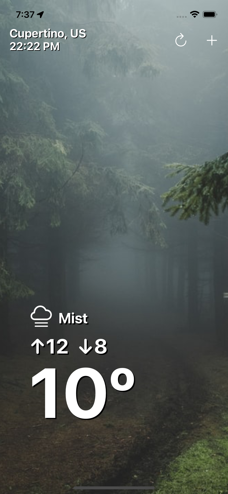

# Click2Weather ☔️

> Simple weather app like Yahoo Weather for iOS

 `1. ` Completely programatically
 `2. ` Get GPS data by CoreLocation
 `3. ` Request to Openweathermap and Unsplash
 `4. ` Implemented Delegation, Singleton Design Pattern

>Preview

